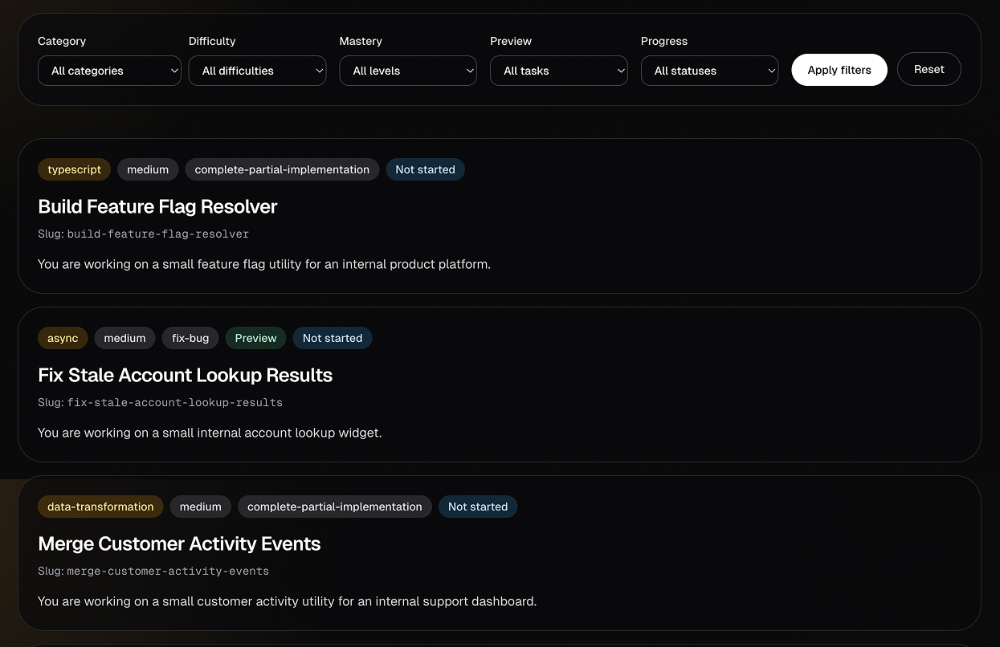
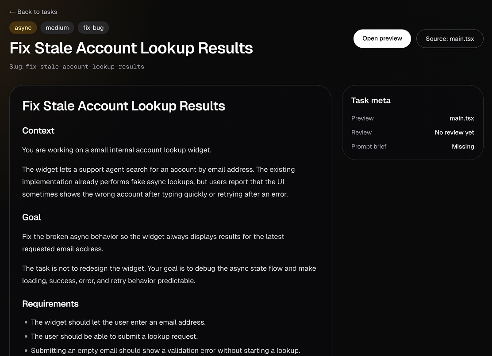

# 🧪 Live Coding Interview Lab

A lightweight workspace for practicing realistic, interview-sized coding tasks with:

- 💡 **ChatGPT** for designing self-contained task briefs
- 🧭 **Codex agent skills** for routing scaffolding, review, and coaching workflows
- 🧑‍💻 **Manual implementation** in a real editor
- 🌐 **Next.js task browser** for task details, metadata, reviews, and optional UI previews

The repository is frontend-oriented by default, while also supporting TypeScript, algorithms, async flows, API integration, testing, performance, and data transformation.

> The goal is deliberate practice, not a showcase application: **brief → scaffold → solve → review → learn**.

## 🖼️ Application preview

<p align="center">
  
  
</p>

## 🚀 Quick start

```bash
npm install
npm run dev
```

Open [http://localhost:3000](http://localhost:3000) to browse the task library. Tasks with preview metadata also expose an interactive preview route.

For a directly executable TypeScript task:

```bash
npx tsx --watch tasks/<category>/<slug>/main.ts
```

This reruns the working file after each save and displays its console output. React/UI tasks should normally be exercised through the Next.js preview app.

## 🔄 Practice workflow

1. **Design a brief:** ChatGPT creates a task using `category`, `taskType`, and `difficulty`. Optional `focus` and `avoid` inputs guide the topic and reduce repetition.

2. **Scaffold the task:** Ask Codex to scaffold, create, set up, or generate the task files. Codex automatically routes through [`agent-skills/scaffold-task.md`](agent-skills/scaffold-task.md), then follows the detailed scaffold workflow.

3. **Solve it manually:** Work in `main.ts` or `main.tsx`. The matching `main.scaffold.*` file remains the original restorable snapshot.

4. **Ask for coaching when needed:** Start a message with `$coach` or `$interview-coach` for read-only hints, checkpoints, debugging nudges, concept explanations, or interview questions.

5. **Request a full review:** Ask Codex to review, check, or evaluate the completed solution. Codex routes through [`agent-skills/review-task.md`](agent-skills/review-task.md), writes `review.md`, assigns an evidence-based Mastery level, and updates task tracking.

## 🧭 Agent skills

The files in `agent-skills/` are concise routing checklists. Detailed behavior remains in the workflow documents under `codex/`.

| Skill | Activation | Purpose |
| --- | --- | --- |
| [`scaffold-task.md`](agent-skills/scaffold-task.md) | Automatic for new task scaffolding requests | Creates the smallest useful task scaffold without solving it |
| [`review-task.md`](agent-skills/review-task.md) | Automatic for completed-solution review requests | Runs the full interviewer-style review workflow |
| [`interview-coach.md`](agent-skills/interview-coach.md) | `$coach`, `$interview-coach`, or a clear active-solving coaching request | Provides progressive, read-only help without taking over |

Example coaching prompts:

```text
$coach tiny hint
$coach explain concept: stable sort
$coach debug nudge
$coach checkpoint
$coach interviewer question
```

Coaching starts with the least revealing useful help and escalates gradually from a hint to a solution outline. It does not edit files, write reviews, or assign Mastery.

## 🗂️ Task structure

Tasks live under a category and stable slug:

```text
tasks/<category>/<slug>/
├── task.md
├── main.scaffold.ts     # or main.scaffold.tsx
├── main.ts              # or main.tsx
└── review.md            # created after a full review
```

- `task.md` contains the brief and workflow metadata.
- `main.scaffold.*` is the original scaffold snapshot.
- `main.*` is the candidate’s working solution.
- `review.md` contains only the latest full review.

Difficulty, task type, skills, problem shape, and review focus belong in `task.md` frontmatter—not in the folder name.

Example paths:

- `tasks/react/search-filter-users/`
- `tasks/data-transformation/normalize-orders/`
- `tasks/async/fix-stale-search-results/`

## 🧩 Task metadata

The source of truth is [`TASK_TAXONOMY.md`](TASK_TAXONOMY.md).

Required request fields:

| Field | Meaning |
| --- | --- |
| `category` | Technical domain, such as `react`, `typescript`, `async`, or `api-integration` |
| `taskType` | Candidate activity, such as `fix-bug`, `refactor-existing-code`, or `write-tests` |
| `difficulty` | `easy`, `medium`, or `hard` |

Optional request inputs:

- `focus` softly guides the topic or skill.
- `avoid` prevents repetition.

Supporting metadata such as `primarySkill`, `secondarySkill`, `problemShape`, `interviewFocus`, `reviewFocus`, and `tags` is inferred for the task brief.

## 🏅 Reviews and Mastery

A full review:

- compares the implementation with the explicit task requirements
- prioritizes correctness and high-signal findings
- saves feedback in `review.md`
- includes concrete `path:line` references
- updates `gpt/gpt_topics.md`
- assigns one evidence-based Mastery level

| Level | Label |
| --- | --- |
| 1/5 | Needs another pass |
| 2/5 | Partially working |
| 3/5 | Mostly working |
| 4/5 | Interview-ready |
| 5/5 | Strong solution |

Mastery is progress feedback, not penalty scoring.

## ♻️ Restore a task

Reset a working solution from its scaffold snapshot:

```bash
npm run restore:scaffold -- tasks/<category>/<slug>
npm run finalize:tasks
```

The restore command replaces the working `main.*`, removes `review.md` when present, and resets the task’s topic-tracking status to `generated`. Run finalization afterward to refresh generated metadata.

## 🛠️ Commands

| Command | Purpose |
| --- | --- |
| `npm run dev` | Validate/sync metadata, then start the Next.js development server |
| `npm run build` | Validate/sync metadata, then create a production build |
| `npm run start` | Start the production server after a build |
| `npm run lint` | Validate/sync metadata, then run ESLint |
| `npm run validate:tasks` | Validate task folders and metadata |
| `npm run finalize:tasks` | Validate tasks and regenerate preview/GPT metadata |
| `npm run restore:scaffold -- tasks/<category>/<slug>` | Restore one task to its initial scaffold |

Codex runs `npm run finalize:tasks` automatically after scaffolding or reviewing a task.

## 🏗️ Repository map

```text
.
├── AGENTS.md                       # Repository-wide Codex rules and routing
├── TASK_TAXONOMY.md                # Taxonomy source of truth
├── agent-skills/
│   ├── scaffold-task.md            # Scaffolding router/checklist
│   ├── review-task.md              # Review router/checklist
│   └── interview-coach.md          # Read-only coaching modes
├── codex/
│   ├── codex_task_scaffold.md      # Detailed scaffolding workflow
│   ├── codex_review_workflow.md    # Detailed review workflow
│   └── review_rubric.md            # Review severity and quality rubric
├── gpt/
│   ├── gpt_chat_starter.md         # Starter context for task-generation chats
│   ├── gpt_new_task_template.md    # Task brief template
│   ├── gpt_topics.md               # Task history and repetition tracking
│   └── gpt_chat_bundle.md          # Generated ChatGPT context bundle
├── scripts/                        # Validation, generation, and restore scripts
├── src/                            # Next.js task browser and preview app
└── tasks/
    └── <category>/<slug>/          # Individual practice tasks
```

## 📚 Source-of-truth documents

- [`AGENTS.md`](AGENTS.md) — repository rules and skill routing
- [`TASK_TAXONOMY.md`](TASK_TAXONOMY.md) — categories, task types, and metadata
- [`codex/codex_task_scaffold.md`](codex/codex_task_scaffold.md) — full scaffold workflow
- [`codex/codex_review_workflow.md`](codex/codex_review_workflow.md) — full review workflow
- [`codex/review_rubric.md`](codex/review_rubric.md) — review calibration
- [`gpt/gpt_topics.md`](gpt/gpt_topics.md) — task history and repetition guard

## ✅ Working principles

### ChatGPT

- Generate one realistic, self-contained brief at a time.
- Avoid repeated topics and problem shapes.
- Do not reveal starter code, pseudocode, hints, or solutions unless asked.

### Codex

- Route matching requests through the relevant agent skill first.
- Keep scaffolds minimal and interview-appropriate.
- Do not solve tasks during scaffolding.
- Review completed work like a practical interviewer.
- Avoid inspecting unrelated task folders.

### Candidate

- Solve the task manually.
- Start with the simplest correct approach.
- Explain tradeoffs and test important edge cases.
- Use coaching for progressive help and full review only when ready.
