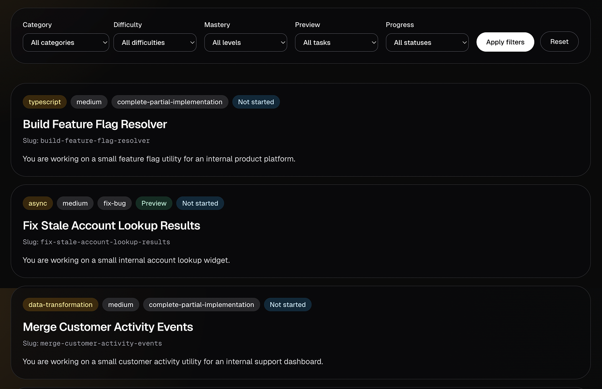
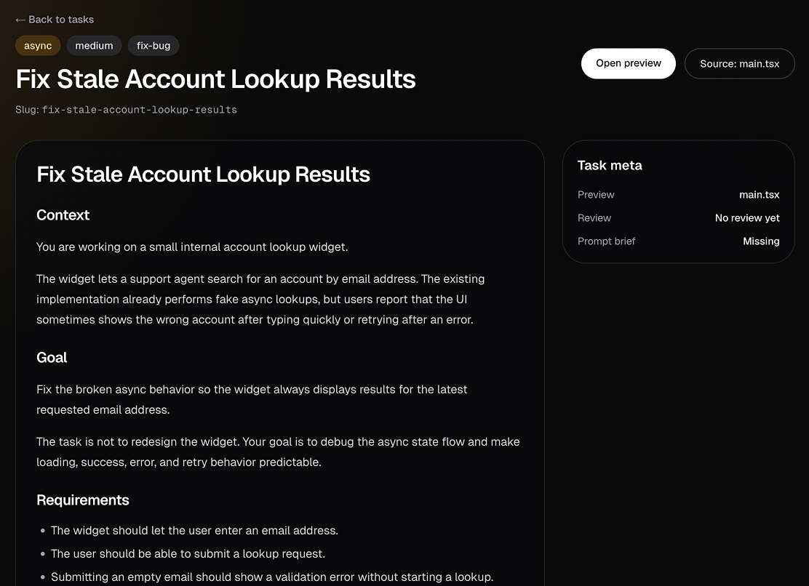

# 🧪 Live Coding Interview Lab

A repository-first system for practicing realistic live-coding interviews.

- 🧭 **Codex** designs tasks by default and runs repeatable creation, scaffold, session, coaching, and review workflows.
- 💬 **ChatGPT** remains an optional place to brainstorm a task before importing one common Task Package.
- 🧑‍💻 **The candidate** evolves one real TypeScript or React implementation through Core Task and staged follow-ups.
- 🌐 **The Next.js website** keeps the task library, filters, reviews, UI previews, and current topics worth revisiting.
- 📚 **Repository data** is the only source of truth; no Notion or remote database is required.

The intended loop is:

```text
create or import → scaffold → solve → checkpoint/follow-up → review → learn
```

## 🖼️ Application preview

<p align="center">
  
  
</p>

## 🚀 Quick start

```bash
npm install
npm run dev
```

Open [http://localhost:3000](http://localhost:3000).

The repository includes one initial task for exercising the complete 2.0 flow:

- task: [http://localhost:3000/tasks/fix-stale-customer-search](http://localhost:3000/tasks/fix-stale-customer-search)
- interactive preview: [http://localhost:3000/tasks/fix-stale-customer-search/preview](http://localhost:3000/tasks/fix-stale-customer-search/preview)

## 🔄 Practice workflow

### 1. Create a task with Codex

Ask Codex for a new live-coding task. Category, difficulty, focus, and exclusions are optional. Codex reads current coverage and learning signals, creates a Task Package v1, and scaffolds it without exposing hidden follow-ups.

Example:

```text
Create a medium React live-coding task. Focus on state modeling and avoid forms.
```

### 2. Or design it in ChatGPT

Attach [`chatgpt/task-designer-context.md`](chatgpt/task-designer-context.md) to a ChatGPT conversation. After brainstorming, ask for the final Task Package v1 and pass it to Codex for import.

Both creation paths produce the same repository files and use the same validation, session, and review workflow.

### 3. Solve the Core Task

Work only in the task's `main.ts` or `main.tsx`. The matching `main.scaffold.*` file is the original restorable snapshot.

For the included UI task, use its preview route. A directly executable TypeScript task can use:

```bash
npx tsx --watch tasks/<category>/<slug>/main.ts
```

### 4. Use the interview session

Codex keeps future follow-ups in `interviewer.md` and reveals them one at a time.

```text
$session start Task: tasks/<category>/<slug>
$session complete-stage Task: tasks/<category>/<slug>
```

Required interviewer questions are stored in `session.json`. A stage cannot close while a question is merely unanswered: answer it or explicitly decline. Completing a resolved stage records a concise, normally silent checkpoint. After the final active stage, the attempt becomes ready for one full review.

### 5. Ask for coaching when needed

```text
$coach tiny hint Task: tasks/<category>/<slug>
$coach explain concept: ... Task: tasks/<category>/<slug>
$coach debug nudge Task: tasks/<category>/<slug>
```

Coaching never edits candidate code. Material help appends one compact event to `session.json` so the final review can consider the topic, stage, and disclosure strength. Help is evidence, not an automatic Mastery penalty.

### 6. Request the final review

Ask Codex to review the task after all active stages are resolved. Codex:

- compares code with the Core Task and active follow-ups;
- uses checkpoint and coaching context;
- writes the latest detailed `review.md`;
- writes compact topic signals to `session.json`;
- assigns evidence-based Mastery;
- regenerates task and learning data automatically.

## 🧭 Codex workflows

| Skill | Activation | Purpose |
| --- | --- | --- |
| [`create-task.md`](agent-skills/create-task.md) | Ask Codex to invent/design a task | Selects a useful target and creates Task Package v1 |
| [`import-task.md`](agent-skills/import-task.md) | Provide a ChatGPT Task Package | Validates it without silently changing requirements |
| [`scaffold-task.md`](agent-skills/scaffold-task.md) | Follows creation/import | Creates minimal candidate files and initial session state |
| [`interview-session.md`](agent-skills/interview-session.md) | `$session`, stage completion, follow-up requests | Persists required questions, records checkpoints, and reveals one follow-up at a time |
| [`interview-coach.md`](agent-skills/interview-coach.md) | `$coach` or a clear hint request | Gives progressive help and records compact telemetry |
| [`review-task.md`](agent-skills/review-task.md) | Ask for a full review | Writes technical feedback and structured learning signals |

The skill files are routing checklists. Detailed behavior lives under `codex/`.

## 🗂️ Task structure

```text
tasks/<category>/<slug>/
├── task.md                 # candidate-safe brief and metadata
├── interviewer.md          # Core intent and hidden staged follow-ups
├── session.json            # attempts, active question, stages, checkpoints, coach, review signals
├── main.scaffold.ts        # or main.scaffold.tsx
├── main.ts                 # or main.tsx; one evolving implementation
└── review.md               # latest full review, present after review
```

Optional support files exist only when the task needs them.

`interviewer.md` is hidden from the normal website and solving flow, but it is not a security boundary in a public repository.

## 🧩 Taxonomy and topics

[`TASK_TAXONOMY.md`](TASK_TAXONOMY.md) defines:

- `category` — technical domain;
- `taskType` — candidate activity;
- `difficulty` — `easy`, `medium`, or `hard`;
- `problemShape` — mental pattern used to avoid repetitive tasks;
- interview and review focus.

[`data/topic-catalog.json`](data/topic-catalog.json) provides stable topic IDs shared by task plans, checkpoints, coach events, and review signals. Generated files track separately what was assigned, reviewed, demonstrated, and marked for repetition.

## 📚 Canonical and generated data

Canonical data:

- task files under `tasks/`;
- [`data/topic-catalog.json`](data/topic-catalog.json);
- taxonomy and workflow contracts.

Generated data:

- [`data/task-index.json`](data/task-index.json) — compact task metadata and current progress;
- [`data/learning-summary.json`](data/learning-summary.json) — coverage and current topics to revisit;
- [`chatgpt/task-designer-context.md`](chatgpt/task-designer-context.md) — bounded context for optional ChatGPT task design;
- `src/lib/generated-task-preview-manifest.tsx` — preview routing.

Do not edit generated files manually. `npm run finalize:tasks` recreates them deterministically.

## 🏅 Reviews and Mastery

| Level | Label |
| --- | --- |
| 1/5 | Needs another pass |
| 2/5 | Partially working |
| 3/5 | Mostly working |
| 4/5 | Interview-ready |
| 5/5 | Strong solution |

Mastery reflects the complete session. A topic becomes a current repetition priority through structured review evidence, not by mechanically subtracting points for coach events.

The website's “Topics to revisit” section is generated from unresolved medium/high topic signals. Later independent demonstration can resolve a topic without rewriting older review history.

## ♻️ Restore or repeat a task

```bash
npm run restore:scaffold -- tasks/<category>/<slug>
```

The command:

- restores the candidate implementation from its scaffold snapshot;
- removes the current `review.md`;
- preserves a compact previous attempt when it contains useful evidence;
- starts a fresh active attempt;
- regenerates all derived data.

## 🛠️ Commands

| Command | Purpose |
| --- | --- |
| `npm run dev` | Validate/regenerate data and start the website |
| `npm run build` | Validate/regenerate data and create a production build |
| `npm run lint` | Validate/regenerate data and run ESLint |
| `npm run validate:tasks` | Validate topic, task, interviewer, session, review, and file contracts |
| `npm run generate:task-data` | Generate task index and learning summary |
| `npm run generate:chatgpt-context` | Generate bounded optional ChatGPT context |
| `npm run finalize:tasks` | Run validation and all current generators |
| `npm run restore:scaffold -- tasks/<category>/<slug>` | Restore a task, start a fresh attempt, and finalize data |

## 🏗️ Repository map

```text
.
├── AGENTS.md
├── TASK_TAXONOMY.md
├── agent-skills/                  # Codex routing checklists
├── codex/                         # Detailed Codex workflows
├── chatgpt/                       # Generated optional ChatGPT context
├── data/                          # Canonical topics and generated learning data
├── docs/                          # Architecture, contracts, and examples
├── scripts/                       # Validation, generation, and restore
├── src/                           # Next.js task and learning browser
└── tasks/<category>/<slug>/       # Practice tasks
```

## 📚 Source-of-truth documents

- [`AGENTS.md`](AGENTS.md) — repository rules and workflow routing
- [`docs/workflow.md`](docs/workflow.md) — intended 2.0 architecture and implementation status
- [`docs/data-contracts.md`](docs/data-contracts.md) — Task Package, interviewer, session, learning, and reset contracts
- [`TASK_TAXONOMY.md`](TASK_TAXONOMY.md) — task taxonomy
- [`codex/codex_task_scaffold.md`](codex/codex_task_scaffold.md) — scaffold behavior
- [`codex/codex_interview_session.md`](codex/codex_interview_session.md) — staged session behavior
- [`codex/codex_review_workflow.md`](codex/codex_review_workflow.md) — final review behavior
